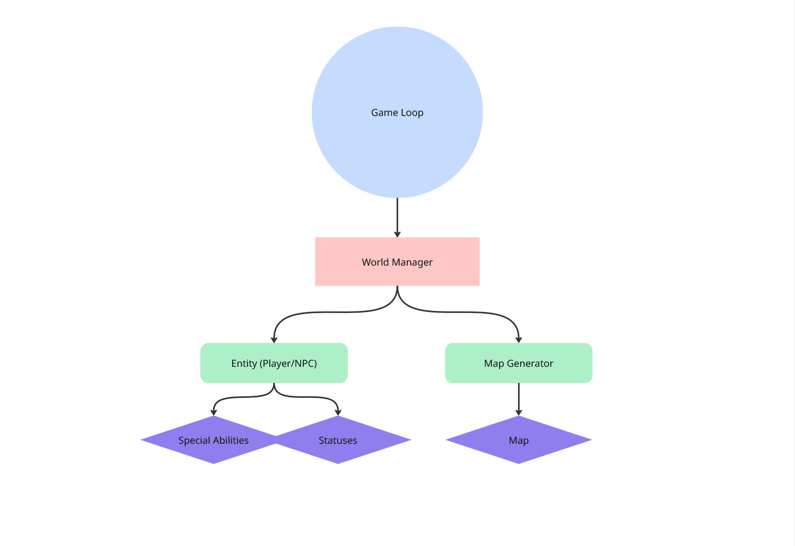
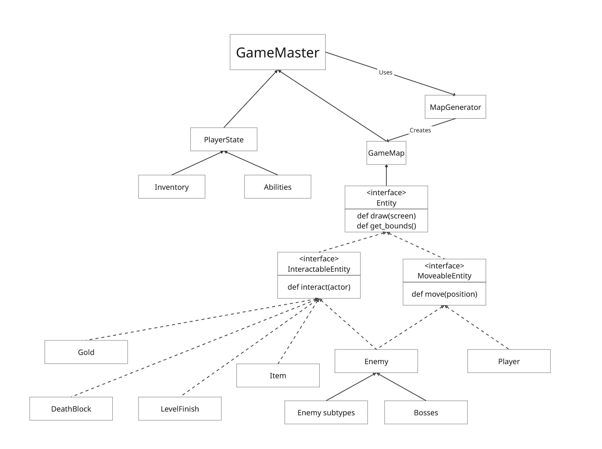
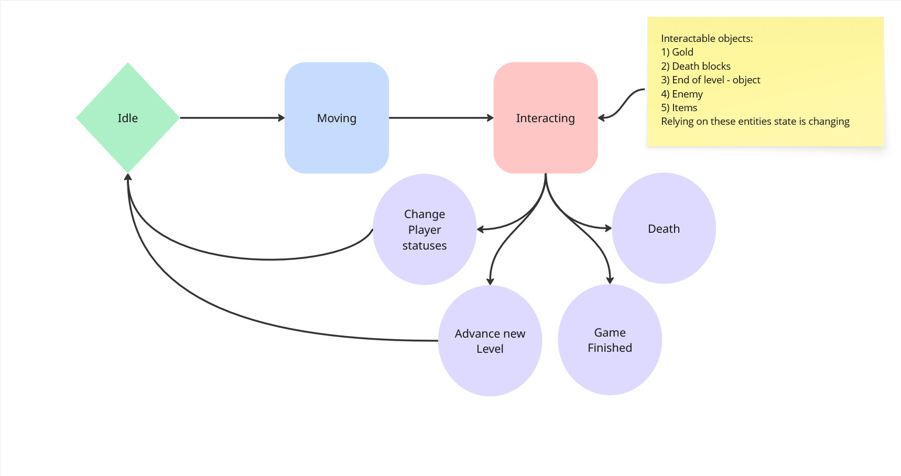

# The GAME

You lost.

## 1. Introduction

The GAME is a 2d roguelike game implemented via Python's PyGame library. The goal of the game is to pass through several procedurally generated levels, avoiding or killing monsters, and beat 3 bosses. Each time the player dies, they lose the progress achieved.

## 2. Architecture drivers
Functional requirements (following features should be fully implemented/supported):
* Procedural map generation.
* Loss of player progress on death
* Inventory, damage system, using abilities.
* Enemy NPCs who can kill the player.
* Rendered  in GUI (PyGame window).

Non-functional requirements:
* Extensibility (support for modifications).
* Performance (the map and AI are updated quickly).
* Cross-platform (can be run on systems with Python 3.10 + pip installed, Windows&Linux support).

## 3. Use cases

### 3.1 Actors
Following actors/roles are considered during the development:
* Player: installs and runs the game without modifications to the files.
* Developer/modification author:  extends the game functionality, adds new NPCs/features/...

### 3.2 Use cases by role

#### 3.2.1 Player

1. Start a new game: when a game is installed correctly, player can select "New game" and load a level.
2. Move the player character: while a level is loaded and the game is active, player can move to unblocked tiles; while moving on a tile with item or monster, item is collected or combat is initiated
3. Die and restart: when the player’s health reaches 0, all progress is reset, and the game returns to the main menu.

#### 3.2.2 Developer/modder

1. Add new enemy types: by defining enemy stats (health, AI, sprite) in JSON, modders can introduce new enemies that have a chance to spwan during level generation.
2. Create custom items: modders can add consumable/equippable items by specifying effects (e.g., healing, teleportation), sprites and various flags (e.g. consume on use) in JSON.

## 4. User description, target audience

The project caters to old-school games fans, e.g. Pacman players, while trying to catch a fresher hipster auditory with newer roguelike design.

## 5. Component diagram

## 6. Class diagram

## 7. Interactions and states ()

## 8. Data description

### 8.1 Data categories

Three data categories are planned for use:

1. persistent data - saved b/w runs
2. runtime game state - is in memory during gameplay
3. asset data - static game resources

### 8.2 Persistent data
Following data is planned to be stored consistently: 
- configured settings: resolution, key bindings
- level generation seed: int
- max player score: int

### 8.3 Runtime game state
This data is held in memory during gameplay:

|data entity|fields|
|-|-|
current game state| state: Enum(in menu/playing/paused/game over)
player state| health: int, position: (int, int), inventory: [item], abilities: [abilities]
level state| number: int, seed: int, map: GameMap, entities: [entity], items: [item]
entity states| type: string, health: int, position: (int, int), ai state: Enum

### 8.4 Assed data
Is loaded from assets/ directory:
- player and enemy sprites
- map textures
- JSON-based enemy configs with base params
- JSON-based item configs with sprites, names, effects and various flags (e.g., consume on use)

## 9. Pattern description
1. Builder: map creation step-by-step
2. Factory: enemy creation during map building/level loading.
3. Template pattern/OOP (Base classes pointed out)
4. State pattern (Game’s behavior depends on state) 
5. Singleton (maybe?) for GameMaster and PlayerState

## 10. Project acceptance criteria

Following criteria must be met for the project to be considered finished:
1. The game runs without errors during startup, level completion, finish and exit in all testing scenarios.
2. Level generation works correctly: 
    * Each level can be technically completed.
    * Moreso, by a casual player.
    * Both the player, items and enemies are spawned into otherwise empty fields.
3. Movement: player and enemies:
    * Can move in expected situations, e.g. to empty fields.
    * Can not move in expected situations, e.g. into a block or into a field where another enemy resides.
4. Combat:
    * The player can damage enemies via use of abilities, items or in other correct game situations.
    * The player can be damaged by enemies on contact or via use of abilities.
    * Both the player and enemies die when their health is lowered to zero.
5. Interface: all interface windows appear correctly, including game menus, level visuals, player and enemy sprites, items and inventory.
6. Performance: the game runs without stutters on a PC with 4 GB RAM & 4-core processor in no less than 60 fps at all times.
### Testing scenarios:
1. Functional testing: no less than 50% of project methods/functions are covered by unit tests.
2. Integration testing
3. Stress testing: running the game in Virtual Machine with RAM, processor cores and VRAM allocated to lowest requirements mentioned above.
### Testing responsibility:
* Functional, stress testing: developers.
* Beta-testing, integration testing: outsource (developer’s younger brother is going to play this).
